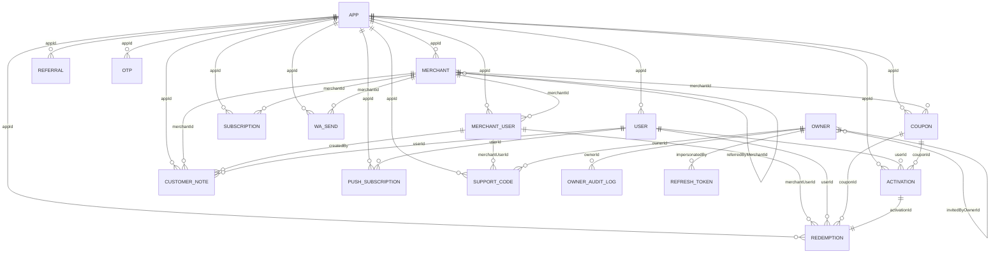

# Modelo de datos — Mi Ciudad

Los modelos Mongoose viven en `apps/api/src/models/`. Extraído del código real.
Contexto: [`../PROJECT.MD`](../PROJECT.MD) §6. API: [`API.md`](API.md).

> **Regla de tenancy:** casi todo lleva **`appId`** (scoped por ciudad). Las excepciones globales
> (cross-tenant) son **Owner**, **OwnerAuditLog**, **RefreshToken**, **MrrSnapshot** y **PasswordReset**.
> El `appId` se resuelve del host, nunca del token → una ciudad no puede tocar los datos de otra.

## Diagrama ER

## Invariantes garantizados por índices únicos (lo importante)

| Modelo | Índice único | Garantía |
|---|---|---|
| Merchant | `(appId, slug)` | slug de comercio único **por ciudad** |
| Merchant | `(appId, referralCode)` (sparse) | código de referido único por ciudad |
| MerchantUser | `(appId, email)` | un login de comercio por email **por ciudad** |
| User | `(appId, telefono)` (partial) | un vecino por teléfono por ciudad |
| Activation | `(appId, codigoNumerico)` | código de canje único por ciudad |
| Activation | `(appId, couponId, userId)` where `status='activo'` (partial) | **un vecino, un solo cupón activo a la vez** (anti doble-tap) |
| Redemption | `(activationId)` | **anti doble-canje** (una activación se canjea una sola vez) |
| Referral | `(appId, referredMerchantId)` | un comercio se cuenta como referido **una sola vez** (idempotencia del crédito) |
| PushSubscription | `(appId, endpoint)` | un endpoint de browser por ciudad (cierra el agujero cross-tenant) |
| Owner | `email` | email de owner único (global) |
| RefreshToken / SupportCode / PasswordReset | `tokenHash` / `codeHash` | token/código de un solo uso |

**TTL (auto-limpieza por `expiresAt`):** Otp (5 min), RefreshToken, SupportCode (~2 min), PasswordReset (30 min).

## Flujo central
`Coupon → Activation → Redemption`: el comercio publica un **Coupon**; el vecino lo **activa**
(crea una **Activation** con código + QR, estado `activo`); el cajero lo **canjea** (crea una
**Redemption** append-only, único por `activationId`, y descuenta stock atómicamente). En paralelo,
publicar el primer cupón confirma un **Referral** pendiente y acredita semanas gratis.

---

## Campos por modelo

> Tablas resumidas (los campos legacy/menores se omiten; ver el schema para el detalle exacto).

### `App` — el tenant/ciudad · colección `apps` · *(es el tenant)*
`slug` (unique), `nombre`, `ciudad`, `provincia`, `pais`, `moneda` (ISO-4217, def ARS),
`locale` (BCP-47, def es-AR), `phonePrefix`, `subdomain` (unique), `customDomain` (unique sparse),
`brand{primaryColor #ea580c, accentColor, logoUrl, heroEyebrow, heroHeadline}`,
`status` (pending/active/suspended/archived), `plan` (founder/standard/enterprise), `precioMensual`,
`operator{nombre,email,whatsapp}`, `legal{razonSocial,taxId,taxIdLabel,condicionFiscal,domicilio,jurisdiccion}`,
`geoCenter{lat,lng}`, `settings{publicCatalog,whatsappEnabled,showOnboarding}`.

### `Merchant` — el comercio · `merchants` · scoped `appId`
`appId`→App, `slug`, `nombre`, `categoria` (enum), `categoriaOtro`, `direccion`, `location` (GeoJSON Point, 2dsphere),
`telefono`, `horarios`/`horariosDetalle`, `logoUrl`/`cover`, `tagline`, `descripcion`, `servicios[]`,
`galeria[]`, `productos[{nombre,precio,descripcion}]`, `redes{instagram,facebook,web,whatsapp}`,
`estado` (pending_payment/activo/suspendido/cancelado), `razonSocial`/`cuit`/`condicionFiscal`/`direccionFiscal`,
`aceptedTcAt`, `arrepentimientoExpiraEn`/`arrepentido`, `freeTrialUntil`,
`referralCode`, `referredByCode`, `referredByMerchantId`→Merchant, `referralWeeksEarned`, `firstCouponAt`.

### `MerchantUser` — login del comercio · `merchantusers` · scoped `appId`
`appId`→App, `merchantId`→Merchant, `email` (unique por app), `nombre`, `rol` (admin/cajero), `lastLoginAt`.

### `User` — el vecino · `users` · scoped `appId`
`appId`→App, `nombre`, `telefono` (unique por app = identidad), `acceptedTcAt`, `lastLoginAt`. (email/dni/whatsapp = legacy).

### `Coupon` — el descuento · `coupons` · scoped `appId`
`appId`→App, `merchantId`→Merchant, `titulo`, `descripcion`, `condiciones`, `porcentaje` (1-100),
`tipoOferta` (porcentaje/precio_fijo), `precioFijo`, `precioReferencia`, `vigenciaHasta`,
`estado` (activo/pausado/agotado/vencido), `stockMaximo`/`stockUsado`, `usoMaxPorPersona`/`usoVentana`
(devida/semana/quincena/mes/ilimitado), `dias[]`/`franjaDesde`/`franjaHasta`, `alcance` (puntual/categoria),
`mostrarAhorroVecino`. Privados (no se serializan al vecino): `costoReferencia`, `objetivo`.

### `Activation` — cupón activado · `activations` · scoped `appId`
`appId`→App, `couponId`→Coupon, `userId`→User, `codigoNumerico` (unique por app), `qrPayload`,
`activatedAt`, `status` (activo/canjeado/expirado/cancelado), `redeemedAt`, `ahorroEstimado`, `montoTicket`, `location`.

### `Redemption` — canje confirmado · `redemptions` · scoped `appId`
`appId`→App, `activationId`→Activation **(unique)**, `couponId`→Coupon, `merchantId`→Merchant,
`userId`→User, `merchantUserId`→MerchantUser, `montoTicket`, `ahorroEstimado`, `redeemedAt`. Append-only.

### `Referral` — referido comercio→comercio · `referrals` · scoped `appId`
`appId`→App, `referrerMerchantId`→Merchant, `referredMerchantId`→Merchant **(unique por app)**,
`referredByCode`, `status` (pending/confirmed/rejected), `rejectedReason`, `weeksGranted`, `referredDaysGranted`, `confirmedAt`.

### `CustomerNote` — nota privada · `customernotes` · scoped `appId`
`appId`→App, `merchantId`→Merchant, `userId`→User, `createdBy`→MerchantUser, `text` (≤1000), `tags[]`.

### `Subscription` — suscripción MP · `subscriptions` · scoped `appId`
`appId`→App, `merchantId`→Merchant, `provider` (mercadopago), `preapprovalId`, `externalReference`,
`status` (pending/authorized/paused/cancelled/rejected), `amountARS`, `currency`, `cycle` (monthly), `nextBillingAt`, `initPoint`, `rawLast`.

### `Otp` — código de login · `otps` · scoped `appId` (global para owner)
`appId`→App, `email`, `purpose` (user/merchant/owner), `codeHash`, `attempts`, `expiresAt` (TTL 5 min), `consumedAt`.

### `PushSubscription` — web push del vecino · `pushsubscriptions` · scoped `appId`
`appId`→App, `endpoint` (unique por app), `keys{p256dh,auth}`, `categories[]`, `userId`→User (opt), `userAgent`.

### `WaSend` — envío de WhatsApp · `wasends` · scoped `appId`
`appId`→App, `merchantId`→Merchant, `to`, `text`, `sentAt`, `ok`, `error`, `campaignId`.

### `MrrSnapshot` — foto diaria de MRR · `mrrSnapshots` · *(global)*
`date` (YYYY-MM-DD, unique, upsert idempotente), `mrrByCurrency`, `mrrByCity[]`, `comerciosActivos`, `suscripcionesActivas`, `capturedAt`.

### `Owner` — admin del SaaS · `owners` · *(global, cross-tenant)*
`email` (unique), `nombre`, `rol` (super/admin/finanzas/soporte/viewer = **RBAC**), `enabled`,
`invitedByOwnerId`→Owner, `invitedAt`, `lastLoginAt`/`lastLoginIp`, `recentActions[]`. (totp* = deprecated).

### `OwnerAuditLog` — auditoría del owner · `ownerauditlogs` · *(global, append-only)*
`ownerId`→Owner, `ownerEmail` (desnormalizado), `action`, `recurso`, `recursoId`, `detail`, `ip`, `at`.
Índices `(ownerId,at)`, `(action,at)`, `(at)`. **Modo soporte:** `action` = `support.session.start` / `support.<método>`.

### `RefreshToken` — sesión hasheada · `refreshtokens` · *(global)*
`tokenHash` (unique), `subjectType` (user/merchant_user/owner), `subjectId`, `expiresAt` (TTL),
`revokedAt`, `impersonatedBy`→Owner (opt) **= marca de modo soporte**, `userAgent`, `ip`.

### `SupportCode` — handoff de modo soporte · `supportcodes` · scoped `appId`
`codeHash` (unique, one-time), `appId`→App, `merchantId`→Merchant, `merchantUserId`→MerchantUser (el admin a impersonar),
`ownerId`→Owner, `ownerEmail`, `expiresAt` (TTL ~2 min), `consumedAt`.

### `PasswordReset` — reset (legacy) · `passwordresets` · *(global)*
`merchantUserId`→MerchantUser (opt), `ownerId`→Owner (opt), `tokenHash` (unique), `expiresAt` (TTL 30 min), `usedAt`.
